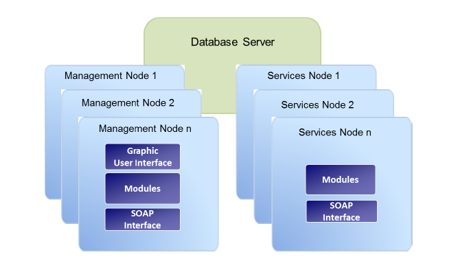
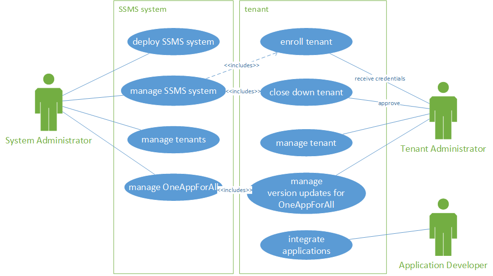

# KOBIL SSMS Overview (Multi-tenant)

## KOBIL Smart Security Management Server (SSMS)
KOBIL System's Smart Security Management Server (SSMS) is a multi-client capable server that handles identities and provides security features. SSMS manages users and their devices. A user can have one or more devices, one device can be used by one or more users. The devices can be either mobile (iOS or Android) or desktop devices (Windows, MacOS). SSMS manages and protects the apps which are operated on the devices. SSMS also interacts with the customer's back end systems to protect business processes end-2-end. The security features of SSMS are based on the included PKI (public key infrastructure) and the included CA (certificate authority).

### Overview
Smart Security Management Server, version 3.0, introduces the feature Multi-Tenancy as one of its main features. The document at hand describes relevant changes compared to previous versions of the SSMS.  The Multi-tenancy feature allows the an SSMS cluster to function as a container for multiple, distinct SSMS instances (tenants). Each such SSMS instance in principle acts as if it was a separately installed SSMS. Each multi-tenant SSMS contains one special tenant, the so-called master tenant. The master tenant is installed automatically when installing SSMS. Each subsequently added tenant is referred to as sub-tenant. Besides offering all the capabilities of a sub-tenant, the master tenant also provides access to system-wide configuration. Multi-tenancy is realized following the "shared schema" approach: The data of all tenants is organized in one database schema, whereby each piece of information is associated to the respective tenant by means of a unique identifier. The document addresses three types of actors and the use cases, they are involved in: 

The System Administrator operates the entire system, comprised of an SSMS cluster that hosts one or more tenants. This includes selecting and updating SSMS modules, and configuring the system-wide aspects of the module. 
The System Administrator has the role SUPER_ADMIN of the master tenant.
The Tenant Administrator manages relevant aspects of one tenant. This involves configuring the modules as required by the Application Developer.
The Tenant Administrator has the role SUPER_ADMIN of the respective tenant.
The Application Developer integrates applications using the APIs provided by the SSMS. The Application Developer acts in the scope of one tenant. 
The Application Developer is not necessarily assigned to a role in SSMS, but might be assigned to any (custom defined) role, when it needs to access SSMS-MGT APIs. 
System Administrator also acts as the Tenant Administrator of the so-called master tenant. 

### Architecture


### Management Nodes: 
With the management node, you c an administrate the server itself and the users and the devices managed by the server. It provides a graphical user interface (GUI) and various views to access the server properties as well as the data managed by the various modules. The basic functions of t he graphical user interface are described in the SSMS administrator manuals. You can find detailed information on the views of the individual modules and on the basic functioning of the GUI in the corresponding module specific administrator manuals. Along with the graphical user interface, the KOBIL SSMS offers a SOAP interface to address programmatically the management functions of the server and to integrate the server, for example, in your existing infrastructure. Both the SOAP interface and the graphical user interface are addressed via the HTTPS protocol and require a registration with a valid certificate (SSL). The KOBIL SSMS manages the certificates itself; more precisely, the server generates a super administrator certificate during the installation . From this certificate, all additional certificates can be generated. You can manage the single functions and options of the different modules and services via the GUI.

### Services Nodes:
The services nodes contain the interfaces for using the managed device s and users. With the ASM module, for example, you can manage t h e apps on the smartphones or on the tablet PCs of the user with the corresponding certificates. The services nodes provide a SOAP interface like the management nodes. With this interface, you can carry out various tasks, services and queries. Depending on the characteristics of the product, you can install various modules with different services. Every single module defines which functions and protocols can be addressed by the SOAP interfaces, as described in the respective module manuals for administrators.

### Affected Use Cases


The System Administrator deploys the SSMS system and manages it. Managing the SSMS system also includes the functions to enroll new tenants as well as to close down existing ones.  The Tenant Administrator receives initial credentials from the System Administrator for a newly enrolled tenant. Likewise, the Tenant Administrator has to give approval, when the tenant shall be closed down. The Tenant Administrator can now basically manage the tenant, as if he is using a single-tenant installation, like creating new users and managing App Versions. However, system specific settings, like URLs or ports, are maintained by the System Administrator and not available per tenant. 

### Database Layer
The core of the feature is basically to provide all functionality of the previous SSMS versions in the scope of different tenants, so that services can be provided to different customers based on one SSMS cluster. Data separation is achieved by discriminating data with an tenantId with each relation in the database (shared-schema approach). Likewise, accesses to the SSMS's APIs are discriminated based on the provided credentials. 


- [Node.js](https://nodejs.org/en/download/) version 14 or above:
  - When installing Node.js, you are recommended to check all checkboxes related to dependencies.

## Generate a new site

Generate a new Docusaurus site using the **classic template**.

The classic template will automatically be added to your project after you run the command:

```bash
npm init docusaurus@latest my-website classic
```

You can type this command into Command Prompt, Powershell, Terminal, or any other integrated terminal of your code editor.

The command also installs all necessary dependencies you need to run Docusaurus.

## Start your site

Run the development server:

```bash
cd my-website
npm run start
```

The `cd` command changes the directory you're working with. In order to work with your newly created Docusaurus site, you'll need to navigate the terminal there.

The `npm run start` command builds your website locally and serves it through a development server, ready for you to view at http://localhost:3000/.

Open `docs/intro.md` (this page) and edit some lines: the site **reloads automatically** and displays your changes.
